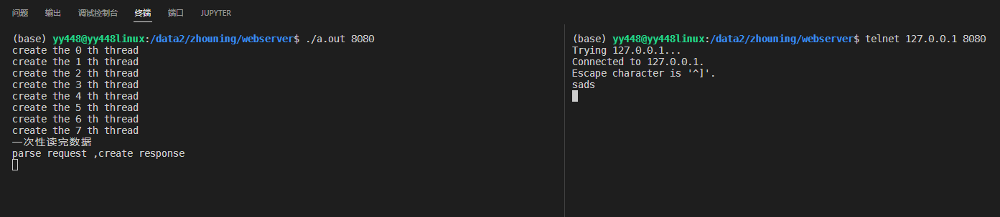
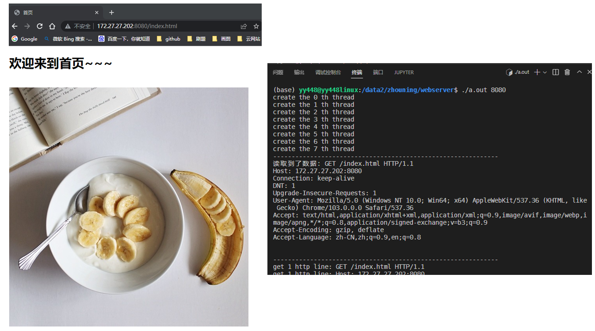
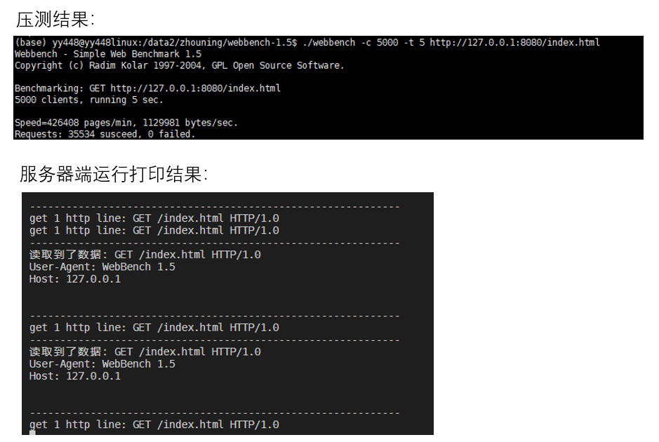

# webserver

## 第一节课

添加线程池的相关内容

## 第二节课

添加了http连接、main函数的相关内容，现在可以接收到http请求，但是对请求进行解析以及回复还没用实现

运行结果：

## 第三节课

学习了http get请求如何进行解析，只应对了很简单的请求许多情况都没有进行处理

## 第四节课

学习了http 回复消息的发送，实现了基本的可运行

运行结果：

压测结果（目前测试5000客户端5s没有问题，到1w就出错）：

